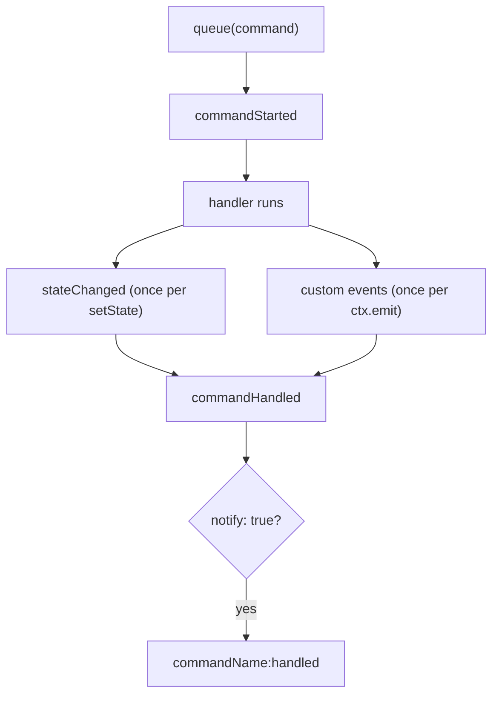
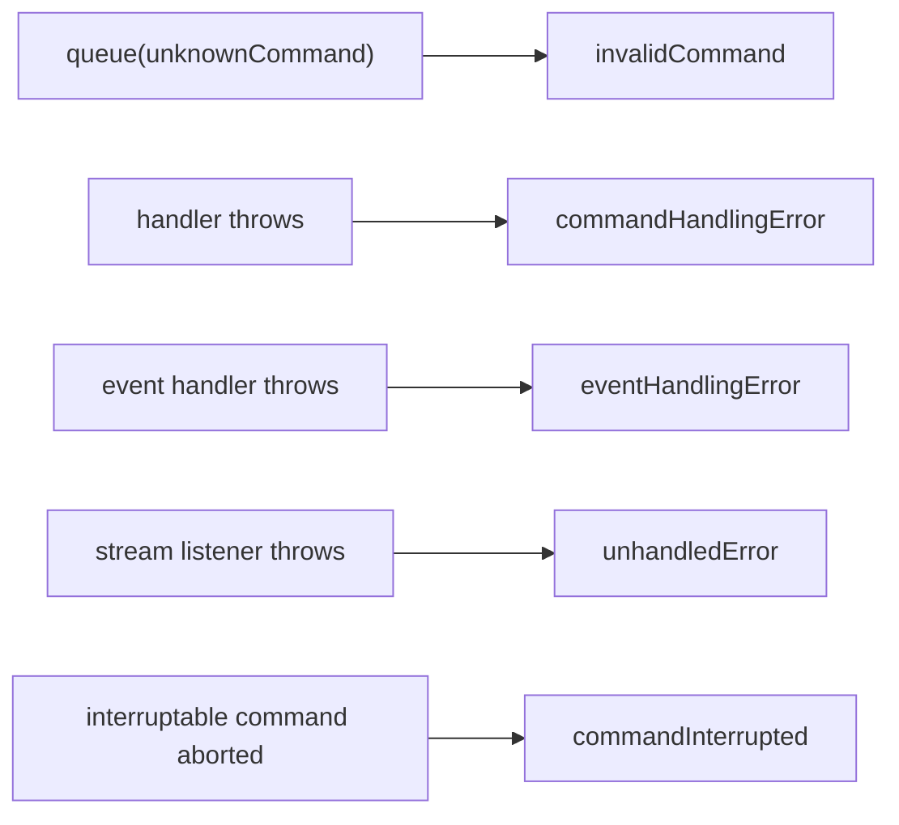

# Event Stream

Every store exposes a stream of all events it emits — builtin and custom. This is the foundation for devtools, logging, analytics, and cross-store coordination.

## The API

```ts
import type { StoreEvent, Unsubscribe } from "@naikidev/commiq";

const unsubscribe: Unsubscribe = store.openStream((event: StoreEvent) => {
  console.log(event.name, event.data);
});

unsubscribe();
```

`openStream` returns an `Unsubscribe`. `closeStream(listener)` still works if you kept the listener reference, but the returned function is the shorter path.

<Callout type="warn">
`openStream` returns an `Unsubscribe`, **not** the store. It cannot be chained. The same applies to `addEventHandler`. Only `addCommandHandler` and `useExtension` return the store for chaining.
</Callout>

Listeners are called **synchronously** as each event is published, before the queue continues. Keep them cheap. A listener that throws is isolated: it is reported through `StoreOptions.onError` with `source: "streamListener"` and published as `unhandledError`, and the remaining listeners still run.

## Builtin events

A command produces this sequence:



<Callout type="info">
**`stateChanged` fires once per `setState` call, not once per command.** A handler that calls `setState` three times publishes three `stateChanged` events. Any code that counts events, or that assumes one `stateChanged` means one command, needs to account for this.
</Callout>

Failure paths:



The full set is `stateChanged`, `commandStarted`, `commandHandled`, `commandInterrupted`, `invalidCommand`, `commandHandlingError`, `eventHandlingError`, `unhandledError`, and `stateReset`.

## Filtering by event type

The export is `BuiltinEvent`, with **PascalCase** keys. Match with `matchEvent`, which narrows `event.data` to the definition's payload type.

```ts
import { BuiltinEvent, matchEvent } from "@naikidev/commiq";

const unsubscribe = store.openStream((event) => {
  if (matchEvent(event, BuiltinEvent.StateChanged)) {
    // event.data is { prev, next }
    console.log("state:", event.data.prev, "→", event.data.next);
  }

  if (matchEvent(event, BuiltinEvent.CommandHandlingError)) {
    // event.data is { command, error }
    reportError(event.data.error, { command: event.data.command.name });
  }
});
```

Comparing `event.id === BuiltinEvent.StateChanged.id` also works but leaves `event.data` as `unknown`, so you would need a cast. Prefer `matchEvent`.

For comparing against a **string** name — when the event arrived over a transport, or you are filtering names generically — use `BuiltinEventName`:

```ts
import { BuiltinEventName } from "@naikidev/commiq";

const isError =
  event.name === BuiltinEventName.CommandHandlingError ||
  event.name === BuiltinEventName.EventHandlingError ||
  event.name === BuiltinEventName.UnhandledError;
```

Event identity is symbol-based, so two `createEvent("same-name")` calls produce definitions that never match each other. Names are for debugging and serialization; `id` is identity.

## Subscribing to auto-notify events

A handler registered with `{ notify: true }` emits `{commandName}:handled` after it completes. `handledEvent(commandName)` returns the definition for it:

```ts
import { createCommand, createCommandDef, handledEvent } from "@naikidev/commiq";

const PlaceOrder = createCommandDef<{ id: string }>("order:place");

_store.addCommandHandler(PlaceOrder, handlePlaceOrder, { notify: true });

_store.addEventHandler(handledEvent("order:place"), (ctx, event) => {
  ctx.queue(createCommand("audit:record", { command: "order:place" }));
});
```

<Callout type="info">
`handledEvent` is **interned** — repeated calls with the same command name return the same `EventDef`, so `addEventHandler` and `matchEvent` match it correctly.

In v1 this did not work: each call minted a fresh symbol, so the lookup always missed and the handler was never invoked, with no error. If you have code from v1 that relied on `handledEvent` and appeared to do nothing, it will start running now.
</Callout>

`createEvent` is **not** interned — it mints a fresh symbol per call by design. Export the definition and import it wherever you need it; do not call `createEvent` twice with the same name and expect a match.

## Example: real-time event log

### Subscribing to multiple stores

```ts
import type { SealedStore, StoreEvent, Unsubscribe } from "@naikidev/commiq";

type LogEntry = {
  storeName: string;
  eventName: string;
  correlationId: string;
  data: unknown;
  time: string;
};

export function createStreamLogger(
  stores: Record<string, SealedStore<never>>,
  onEntry: (entry: LogEntry) => void,
): Unsubscribe {
  const unsubscribes: Unsubscribe[] = [];

  for (const [storeName, store] of Object.entries(stores)) {
    unsubscribes.push(
      store.openStream((event: StoreEvent) => {
        onEntry({
          storeName,
          eventName: event.name,
          correlationId: event.correlationId,
          data: event.data,
          time: new Date(event.timestamp).toISOString(),
        });
      }),
    );
  }

  return () => {
    for (const unsubscribe of unsubscribes) unsubscribe();
  };
}
```

Every `StoreEvent` carries `timestamp`, `correlationId`, and `causedBy`. Use the event's own `timestamp` rather than `Date.now()` in the listener — they can differ, and `correlationId` is what lets you group an event with the command that produced it.

### React component

`useStream` from `@naikidev/commiq-react` wraps a single store's stream with automatic cleanup. For several stores at once, the helper above inside a `useEffect` is clearer:

```tsx
import { useEffect, useState } from "react";
import { createStreamLogger } from "./stream-logger";

const MAX_ENTRIES = 200;

export function EventStreamViewer() {
  const [entries, setEntries] = useState<LogEntry[]>([]);

  useEffect(() => {
    return createStreamLogger(
      { counter: counterStore, todo: todoStore },
      (entry) => setEntries((prev) => [...prev.slice(-MAX_ENTRIES), entry]),
    );
  }, []);

  return (
    <table>
      <thead>
        <tr>
          <th>Time</th>
          <th>Store</th>
          <th>Event</th>
          <th>Data</th>
        </tr>
      </thead>
      <tbody>
        {entries.map((entry) => (
          <tr key={`${entry.correlationId}-${entry.eventName}-${entry.time}`}>
            <td>{entry.time}</td>
            <td>{entry.storeName}</td>
            <td>{entry.eventName}</td>
            <td>{JSON.stringify(entry.data)}</td>
          </tr>
        ))}
      </tbody>
    </table>
  );
}
```

<Callout type="warn">
`setState` inside a stream listener means a React render is triggered synchronously from inside the store's publish path. That is fine for a bounded debug panel; it is not a pattern for application data. Read state with [`useSelector`](/react/hooks), which batches through `useSyncExternalStore`.
</Callout>

## Use cases

| Use case | Approach |
| --- | --- |
| **Devtools** | `createDevtools()` + `connect(store, name)` — a ring-buffered timeline with causality chains, rather than a hand-rolled log |
| **Analytics** | Filter for specific domain events with `matchEvent` and forward them |
| **Undo/redo** | `withHistory(store)` from `commiq-context` keeps a bounded buffer of state transitions |
| **Cross-store sync** | `createEventBus()` — routes events between stores and is refcounted, so double-connecting is safe |
| **Testing** | Collect events during a command, then assert after `await flush()` |
| **Error monitoring** | `StoreOptions.onError` — it sees stream-listener and extension failures that no event channel reports |
