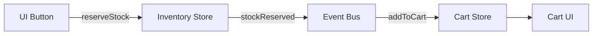

# Store Dependencies

When your application grows, you'll often need multiple stores that react to each other's events. The **Event Bus** enables this by routing events between connected stores — keeping them decoupled.

## The Pattern



The inventory store doesn't know about the cart. The cart store doesn't know about inventory. The event bus wires them together.

## Example: Shop with Inventory & Cart

### 1. Define the stores

```ts
import {
  createStore,
  createCommand,
  createEvent,
  sealStore,
} from "@naikidev/commiq";

// Events shared between stores
const stockReserved = createEvent<{ productId: number; qty: number }>(
  "stockReserved",
);
const outOfStock = createEvent<{ productId: number }>("outOfStock");

// ── Inventory Store ──
const _inventoryStore = createStore<InventoryState>({
  products: [
    { id: 1, name: "Keyboard", price: 79, stock: 3 },
    { id: 2, name: "USB-C Hub", price: 45, stock: 5 },
  ],
});

_inventoryStore.addCommandHandler<{ productId: number; qty: number }>(
  "reserveStock",
  (ctx, cmd) => {
    const { productId, qty } = cmd.data;
    const product = ctx.state.products.find((p) => p.id === productId);

    if (!product || product.stock < qty) {
      ctx.emit(outOfStock, { productId });
      return;
    }

    ctx.setState({
      products: ctx.state.products.map((p) =>
        p.id === productId ? { ...p, stock: p.stock - qty } : p,
      ),
    });
    ctx.emit(stockReserved, { productId, qty });
  },
);

export const inventoryStore = sealStore(_inventoryStore);

// ── Cart Store ──
const _cartStore = createStore<CartState>({ items: [], lastError: "" });

_cartStore.addCommandHandler<{
  productId: number;
  name: string;
  price: number;
}>("addToCart", (ctx, cmd) => {
  ctx.setState({
    ...ctx.state,
    items: [...ctx.state.items, { ...cmd.data, qty: 1 }],
  });
});

export const cartStore = sealStore(_cartStore);
```

### 2. Wire with Event Bus

```ts
import { createEventBus, createCommand } from "@naikidev/commiq";

const bus = createEventBus();
bus.connect(_inventoryStore);
bus.connect(_cartStore);

// When stock is reserved → add item to cart
bus.on(stockReserved, (event) => {
  const product = _inventoryStore.state.products.find(
    (p) => p.id === event.data.productId,
  );
  if (product) {
    _cartStore.queue(
      createCommand("addToCart", {
        productId: product.id,
        name: product.name,
        price: product.price,
      }),
    );
  }
});

// When out of stock → show error
bus.on(outOfStock, () => {
  _cartStore.queue(createCommand("setError", "Item is out of stock"));
});
```

### 3. Use in React

```tsx
function ShopPage() {
  const products = useSelector(inventoryStore, (s) => s.products);
  const cart = useSelector(cartStore, (s) => s.items);
  const queueInventory = useQueue(inventoryStore);

  return (
    <>
      {products.map((p) => (
        <button
          key={p.id}
          disabled={p.stock === 0}
          onClick={() =>
            queueInventory(
              createCommand("reserveStock", { productId: p.id, qty: 1 }),
            )
          }
        >
          {p.name} ({p.stock} left)
        </button>
      ))}
      <p>Cart: {cart.length} items</p>
    </>
  );
}
```

## Key Takeaways

- **Stores stay decoupled** — they only know about their own commands and events
- **The event bus is the glue** — it subscribes to streams and routes events to commands
- **Events are shared via imports** — both stores reference the same `EventDef` objects (matched by symbol identity)
- **Unidirectional flow** — Command → Handler → Event → Bus → Command on another store
