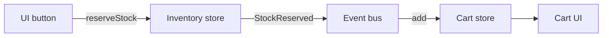

# Store Dependencies

As an application grows you often need stores that react to each other's events. The **event bus** routes events between connected stores, keeping them decoupled.

## The pattern


```mermaid
flowchart LR
    UI["UI button"] -->|reserveStock| Inventory["Inventory store"]
    Inventory -->|StockReserved| Bus["Event bus"]
    Bus -->|add| Cart["Cart store"]
    Cart --> CartUI["Cart UI"]
```

The inventory store knows nothing about the cart. The cart store knows nothing about inventory. The bus wires them together and is the only file that knows the whole flow.

## 1. Shared events and commands

Define the events once and import them everywhere. Event identity is the **symbol** on the `EventDef`, so a second `createEvent("stockReserved")` produces a definition that never matches the first.

```ts title="features/shop/events.ts"
import { createEvent } from "@naikidev/commiq";

export const InventoryEvent = {
  StockReserved: createEvent<{ productId: number; qty: number }>("inventory:stockReserved"),
  OutOfStock: createEvent<{ productId: number }>("inventory:outOfStock"),
};
```

```ts title="features/shop/commands.ts"
import { createCommandDef } from "@naikidev/commiq";

export const InventoryCommand = {
  reserveStock: createCommandDef<{ productId: number; qty: number }>("inventory:reserveStock"),
};

export const ShopCartCommand = {
  add: createCommandDef<{ productId: number; name: string; price: number }>("shopCart:add"),
  remove: createCommandDef<{ productId: number }>("shopCart:remove"),
  setError: createCommandDef<{ message: string }>("shopCart:setError"),
};
```

## 2. The stores

```ts title="features/shop/store.ts"
import { createStore, sealStore } from "@naikidev/commiq";
import { InventoryCommand, ShopCartCommand } from "./commands";
import { InventoryEvent } from "./events";

export type Product = {
  readonly id: number;
  readonly name: string;
  readonly price: number;
  readonly stock: number;
};

type InventoryState = {
  readonly products: readonly Product[];
};

const _inventoryStore = createStore<InventoryState>({
  products: [
    { id: 1, name: "Wireless Keyboard", price: 79, stock: 3 },
    { id: 2, name: "USB-C Hub", price: 45, stock: 5 },
  ],
});

_inventoryStore.addCommandHandler(
  InventoryCommand.reserveStock,
  (ctx, cmd) => {
    const { productId, qty } = cmd.data;
    const product = ctx.state.products.find((candidate) => candidate.id === productId);

    if (!product || product.stock < qty) {
      ctx.emit(InventoryEvent.OutOfStock, { productId });
      return;
    }

    ctx.setState((prev) => ({
      products: prev.products.map((candidate) =>
        candidate.id === productId
          ? { ...candidate, stock: candidate.stock - qty }
          : candidate,
      ),
    }));
    ctx.emit(InventoryEvent.StockReserved, { productId, qty });
  },
  { notify: true },
);

export const inventoryStore = sealStore(_inventoryStore);
```

Insufficient stock emits `OutOfStock` and returns rather than throwing. It is not a failure — the command did exactly what it should. The handle settles as `handled`, and the outcome is carried by which event was emitted.

```ts title="features/shop/cartStore.ts"
type ShopCartItem = {
  readonly productId: number;
  readonly name: string;
  readonly price: number;
  readonly qty: number;
};

type ShopCartState = {
  readonly items: readonly ShopCartItem[];
  readonly lastError: string;
};

const _cartStore = createStore<ShopCartState>({ items: [], lastError: "" });

_cartStore
  .addCommandHandler(ShopCartCommand.add, (ctx, cmd) => {
    const { productId, name, price } = cmd.data;
    const existing = ctx.state.items.some((item) => item.productId === productId);

    ctx.setState((prev) => ({
      ...prev,
      items: existing
        ? prev.items.map((item) =>
            item.productId === productId ? { ...item, qty: item.qty + 1 } : item,
          )
        : [...prev.items, { productId, name, price, qty: 1 }],
    }));
  })
  .addCommandHandler(ShopCartCommand.setError, (ctx, cmd) => {
    ctx.setState((prev) => ({ ...prev, lastError: cmd.data.message }));
  });

export const shopCartStore = sealStore(_cartStore);
```

Both state types are fully `readonly`. `ctx.state` is `DeepReadonly<S>`, so a mutable `ShopCartItem[]` would make `{ ...prev, items: ... }` fail to compile — see [store file structure](/patterns/store-file-structure).

## 3. Wire with the event bus

```ts title="features/shop/bus.ts"
import { createEventBus } from "@naikidev/commiq";
import { ShopCartCommand } from "./commands";
import { InventoryEvent } from "./events";
import { inventoryStore } from "./store";
import { shopCartStore } from "./cartStore";

export function connectShop() {
  const bus = createEventBus();

  bus.connect(inventoryStore);
  bus.connect(shopCartStore);

  bus.on(InventoryEvent.StockReserved, (event) => {
    const product = inventoryStore.state.products.find(
      (candidate) => candidate.id === event.data.productId,
    );
    if (!product) return;

    shopCartStore.queue(ShopCartCommand.add, {
      productId: product.id,
      name: product.name,
      price: product.price,
    });
  });

  bus.on(InventoryEvent.OutOfStock, (event) => {
    const product = inventoryStore.state.products.find(
      (candidate) => candidate.id === event.data.productId,
    );

    shopCartStore.queue(ShopCartCommand.setError, {
      message: `"${product?.name ?? "Product"}" is out of stock`,
    });
  });

  return () => bus.destroy();
}
```

`connect` and `on` both return an `Unsubscribe`, and `bus.destroy()` detaches everything in one call. Connections are **refcounted**, so connecting the same store from two modules is safe: the first `disconnect` decrements rather than detaching.

Call the setup function once at startup and keep the teardown for hot-module replacement:

```ts title="main.ts"
import { connectShop } from "./features/shop/bus";

const disconnectShop = connectShop();

if (import.meta.hot) {
  import.meta.hot.dispose(disconnectShop);
}
```

Without teardown, HMR leaves the old bus attached and every event is routed twice — one click adds two items to the cart.

<Callout type="warn">
Bus handlers run **synchronously** inside the emitting store's publish path, and a handler that throws is caught and logged (outside production) rather than routed to any store's `onError`. Keep them to routing only: read `event.data`, queue a command, return. Async work belongs in the receiving store's command handler, where the store's error channel covers it.
</Callout>

## 4. Use in React

```tsx title="features/shop/ShopPage.tsx"
import { useSelector, useQueue } from "@naikidev/commiq-react";
import { InventoryCommand } from "./commands";
import { inventoryStore } from "./store";
import { shopCartStore } from "./cartStore";

export function ShopPage() {
  const products = useSelector(inventoryStore, (state) => state.products);
  const items = useSelector(shopCartStore, (state) => state.items);
  const queueInventory = useQueue(inventoryStore);

  return (
    <>
      {products.map((product) => (
        <button
          key={product.id}
          disabled={product.stock === 0}
          onClick={() =>
            queueInventory(InventoryCommand.reserveStock, {
              productId: product.id,
              qty: 1,
            })
          }
        >
          {product.name} ({product.stock} left)
        </button>
      ))}
      <p>Cart: {items.length} items</p>
    </>
  );
}
```

The component dispatches to inventory only. The cart update happens through the bus, so the component has no idea two stores are involved.

## Tracing the flow

A command queued by a bus handler carries a `causedBy` linking it to the event that triggered it, so the whole path is one causality chain. Connect both stores to one devtools instance to walk it:

```ts
import { createDevtools } from "@naikidev/commiq-devtools-core";

const devtools = createDevtools({ maxEvents: 500 });
devtools.connect(inventoryStore, "inventory");
devtools.connect(shopCartStore, "cart");
```

`devtools.getChain(correlationId)` then reconstructs the chain across the store boundary. There is no `stores` option on `createDevtools` — every store needs its own `connect` call, and a store that is never connected produces no timeline entries and no error. See [composing plugins](/patterns/composing-plugins).

## Key takeaways

- **Stores stay decoupled** — each knows only its own commands and events
- **The bus is the glue** — it subscribes to streams and routes events to commands
- **Events are shared via imports** — both sides reference the same `EventDef`, matched by symbol identity
- **Unidirectional flow** — command → handler → event → bus → command on another store
- **`flush()` is per store** — awaiting a cross-store cascade means awaiting each store in turn, upstream first
- **Cycles are not detected** — if A reacts to B and B reacts to A, the loop is tight enough to lock the tab

See [multi-store coordination](/patterns/multi-store-coordination) for cycle avoidance, teardown, and when `openStream` is a better fit than a bus.
